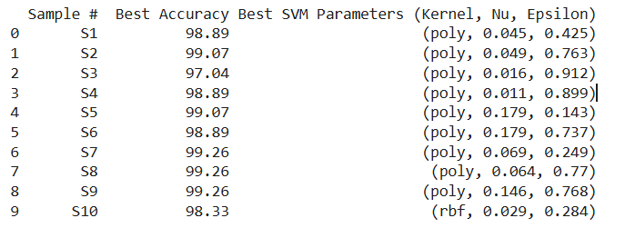
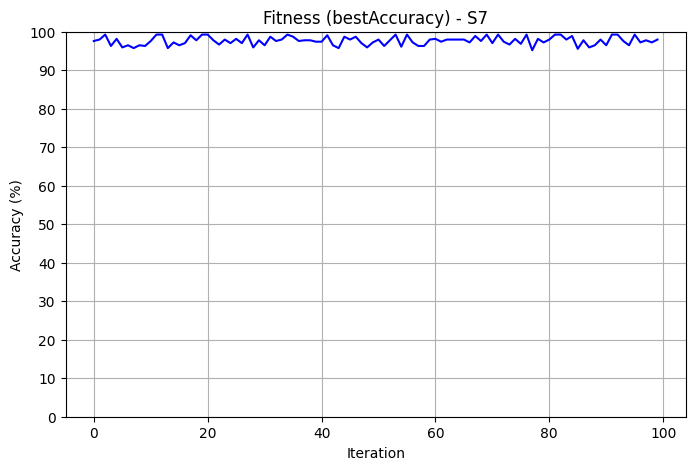

# SVM Optimization on UCI Digits Dataset

This project performs hyperparameter optimization of a Support Vector Machine (SVM) classifier on the **UCI Optical Recognition of Handwritten Digits** dataset. The goal is to evaluate the performance of an SVM classifier using multiple train-test samples and track the convergence of accuracy over 100 randomized optimization iterations.

Author: **Vaibhavv Garg**  
Roll Number: **102203381**
---

## 📊 Dataset

We use the [`load_digits`](https://scikit-learn.org/stable/modules/generated/sklearn.datasets.load_digits.html) dataset from Scikit-learn (UCI-origin), which contains:
- **1797 samples** of 8x8 pixel handwritten digits (0 to 9)
- **64 features** (flattened pixel intensities)
- **10 classes** (digits 0 to 9)

---

## 🛠️ Methodology

- The dataset is randomly split **10 times** into 70% training and 30% testing sets.
- For each split:
  - The data is standardized.
  - **100 iterations** of randomized SVM optimization are run.
  - The best accuracy and corresponding hyperparameters are recorded.
- **SVM Classifier Used**: `sklearn.svm.NuSVC`
- Hyperparameters randomized:
  - `kernel`: `'linear'`, `'rbf'`, `'poly'`
  - `nu`: float ∈ [0.01, 0.4]
  - `epsilon`: float ∈ [0.01, 1] *(only recorded, not used in `NuSVC`)*

---

## 📈 Outputs

- `svm_optimization_results.csv`: Accuracy and best parameters for each sample
- `convergence_best_svm.png`: Plot showing accuracy vs iteration for the best-performing sample
- Console output of all 10 sample results

---

